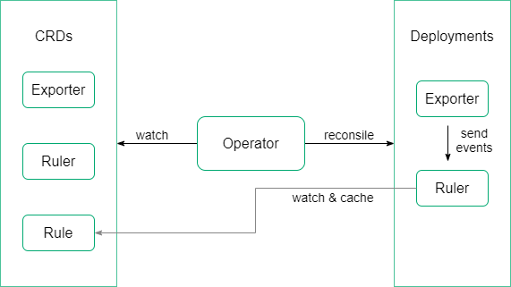

# kube-events

Kube-events revolves around Kubernetes Event, covering multi-dimensional processing of them, such as emitting events to sinks, issuing notifications and generating alerts. In some of these dimensions, configurable filtering rules are provided to meet different business needs.

Kube-events contains two major business components, Exporter and Ruler. Exporter watches Kubernetes Event and emits events to sinks. Ruler receives events, filters them by rules, then issues notifications or processes them as alerts which will eventually be sent to alertmanager or webhooks. 

Another component called Operator is responsible for the desired state of the previous business components. This relies on the following three crds to achieve:
- **`Exporter`**, which defines a desired Exporter deployment. Operator ensures at all times that a Exporter matching the resource definition is running.
- **`Ruler`**, which defines a desired Ruler deployment. The Operator ensures at all times that a Ruler matching the resource definition is running.
- **`Rule`**, which defines a desired Rule set, which will be used to filter events by Ruler. 

To learn more about the CRDs introduced by the kube-events have a look at the [design doc](doc/api.md).

The architecture diagram is as follows:  


# Quickstart

Install quickly kube-events into your kubernetes cluster with the following commands:
```bash
kubectl apply -f https://raw.githubusercontent.com/kubesphere/kube-events/release-0.6/config/bundle.yaml
kubectl apply -f https://raw.githubusercontent.com/kubesphere/kube-events/release-0.6/config/crs/bundle.yaml
```

Or install it  by [helm chart](./helm/README.md).

# Videos & blogs
[K8s events exporting, filtering, alerting and notification in multi-tenant env](https://v.qq.com/x/page/v3130vg5lme.html)

# Usage

## Rule

`Rule` is used to define filtering rules for events. Each `Rule` instance can be configured with a set of rules. When configuring these instances, set a label called `kubesphere.io/rule-scope` to distinguish the scope of rules, to meet the needs of multi-tenancy.
- **`kubesphere.io/rule-scope: cluster`**  
This level of `Rule` does not need to specify the namespace when it is configured, it will be stored in the namespace which the operator belongs to. Filtering rules in it will be applied to the events of the entire cluster.
- **`kubesphere.io/rule-scope: namespace`**
When configuring a `Rule` instance at this level, you need to specify the namespace. Rules in it will be applied to the events whose `involvedObject.namespace` equals to the namespace which this `Rule` instance belongs to.
- **`kubesphere.io/rule-scope: workspace`**
This is an intermediate level of scope control. It will act on events of multiple namespaces. It needs to be specified a label called `kubesphere.io/workspace`, which will be used to select the namespaces with the same label. Rules in it will be applied to the events whose `involvedObject.namespace` is in these selected namespaces. (It will be stored in the same namespace to the cluster-level instances)

## Exporter

Exporter component is configured by `Exporter`. Exporter currently supports output events to stdout and webhook. In fact, Ruler component is such a webhook.

If you want to collect events from the exporter's stdout and output them to a specific place, fluentbit is a good choice. To achieve this, by [fluentbit-operator](https://github.com/kubesphere/fluentbit-operator) which provides flexibility and convenience of fluentbit configuration, just add some `Input`/`Filter`/`Output` plugins as needed. For example, the following provides plugins which will finally output events to es: 
```yaml
apiVersion: logging.kubesphere.io/v1alpha2
kind: Input
metadata:
  name: tail-events
  namespace: kubesphere-logging-system
  labels:
    logging.kubesphere.io/enabled: "true"
    logging.kubesphere.io/component: "events"
spec:
  tail:
    tag: kube_events
    path: /var/log/containers/*_kubesphere-logging-system_events-exporter*.log
    parser: docker
    refreshIntervalSeconds: 10
    memBufLimit: 5MB
    skipLongLines: true
    db: /fluent-bit/tail/pos-events.db
    dbSync: Normal
---
apiVersion: logging.kubesphere.io/v1alpha2
kind: Output
metadata:
  name: es-events
  namespace: kubesphere-logging-system
  labels:
    logging.kubesphere.io/enabled: "true"
    logging.kubesphere.io/component: "events"
spec:
  match: kube_events
  es:
    host: elasticsearch-logging-data.kubesphere-logging-system.svc
    port: 9200
    logstashPrefix: ks-logstash-events
    logstashFormat: true
---
apiVersion: logging.kubesphere.io/v1alpha2
kind: Filter
metadata:
  name: filter-events
  namespace: kubesphere-logging-system
  labels:
    logging.kubesphere.io/enabled: "true"
    logging.kubesphere.io/component: "events"
spec:
  match: kube_events
  filters:
  - parser:
      keyName: log
      parser: json
```

## Ruler

Ruler component is configured by `Ruler`. Ruler component filters the received events through rules and may generate event notifications or alerts. Alert messages can be configured to be sent to the alertmanager service.

And webhooks can be also configured to receive these notifications or alerts.